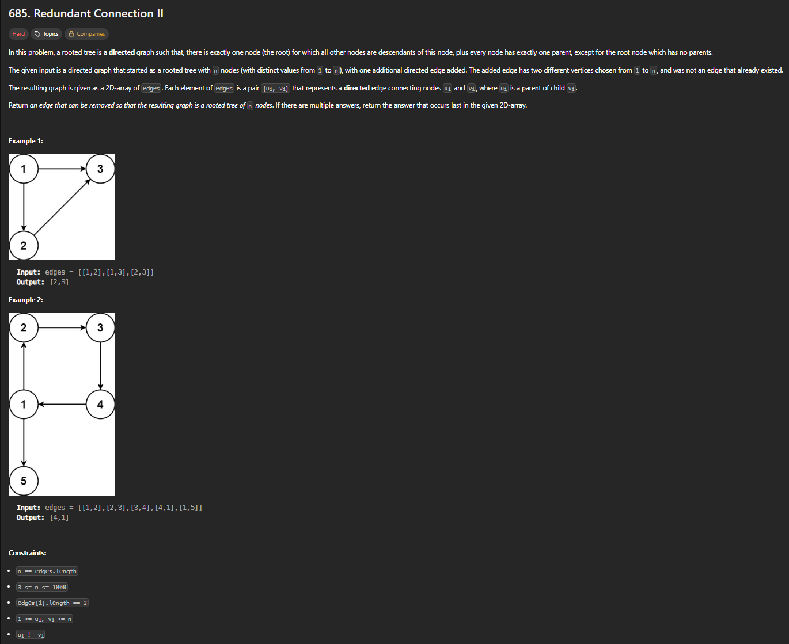

# Exercícios sobre Grafos 1

**Conteúdo da Disciplina**: Grafos 1 

## Alunos

|Matrícula | Aluno |
| -- | -- |
| 20/2023663 | Gabriel Basto Bertolazi |
| 20/2017503 | Wildemberg Sales da Silva Junior |

## Sobre

Esse exercício visa buscar a resolução dos exercícios escolhidos pela plataforma do LeetCode, com o objetivo de mostrar nossos conhecimentos aprendidos no conteúdo de grafos 1. Neles vamos aplicar conceitos e conhecimentos de lógica aprendidos na matéria de Projeto de Algoritmos com o professor MAurício Serrano.

Principais funcionalidades:
- Identificar o caminho mais longo em uma matriz por meio de grafos.
- Pegar um caminho fornecido pelo usuário e fazer a soma desse caminho.
- Árvores binárias de busca.

## Screenshots

### Visualização de Grafo → Execução de Algoritmo →  Resultado de Caminho Mínimo

---

---

---

## Instalação

sudo apt update && sudo apt install -y build-essential

## Uso

gcc questao_x.c -o questao_x
./questao_x

## Apresentação

Vídeo disponível em: [youtube]

## Outros

Para dúvidas, sugestões ou melhorias, entre em contato com os autores.
